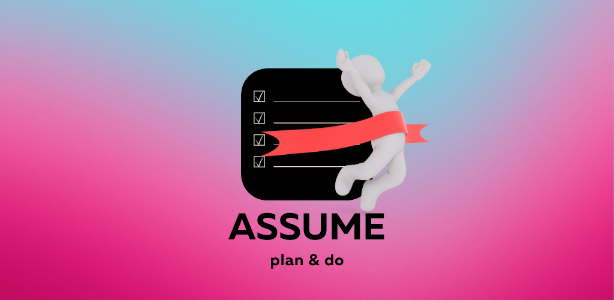
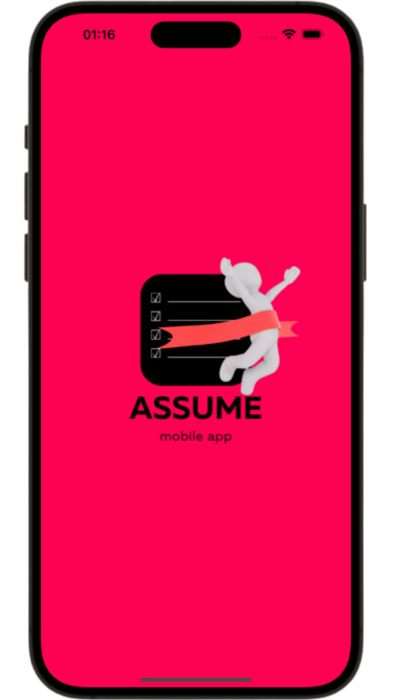
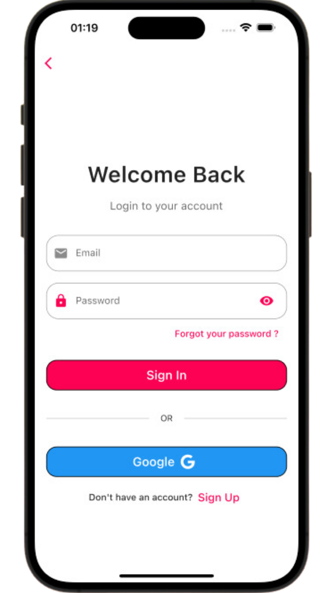
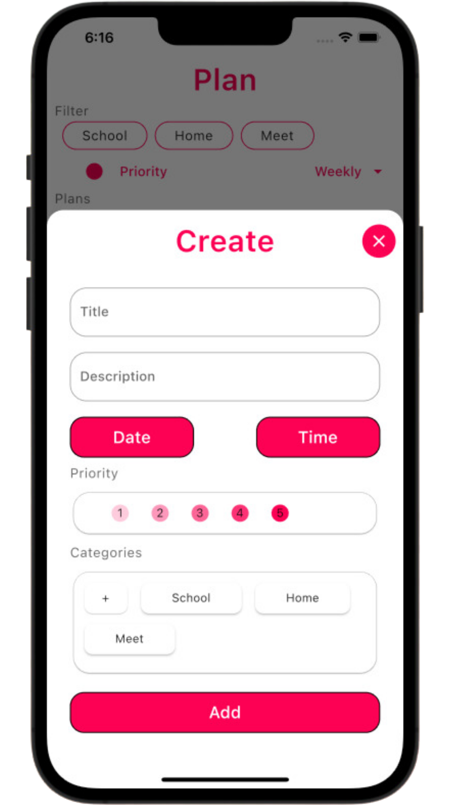
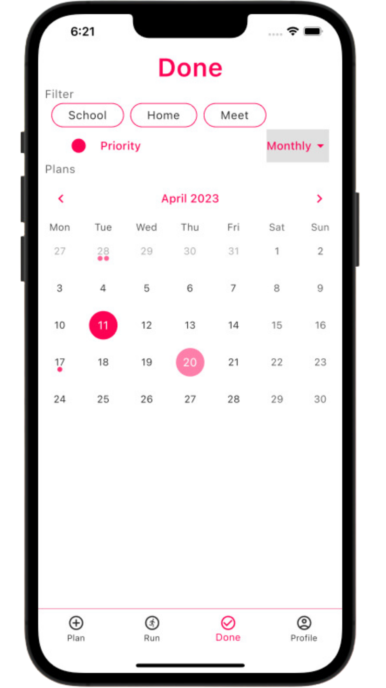
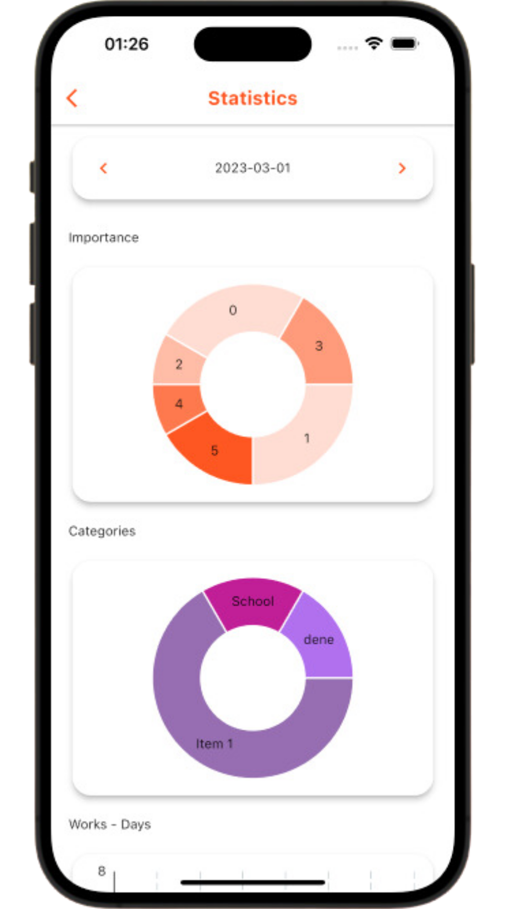
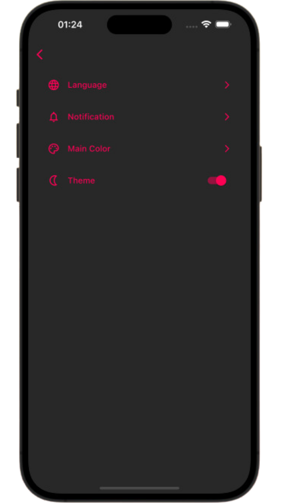
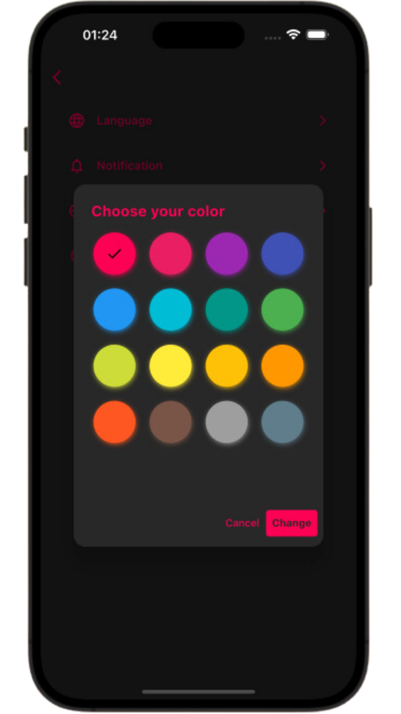

# Assume: Plan & Do

Assume App is an open source mobile application where you can manage your plans and see the statistics of the tasks you have done. In addition, there are areas in the application that you can customize according to your own taste.

The application is currently only published in the google play store.

 [**Google Play Store**](https://sites.google.com/view/assumeapp)

 [**Official Website**](https://sites.google.com/view/assumeapp)

## Features

- Light/dark mode toggle
- App main color changeable (Color palette has 16 color)
- Language support (as English/Turkish for now)
- Authentication contains
- Email service for forgot password
- Notifications of tasks
- Statistic of tasks
- Create task operation
- Plan-Run-Done operation of tasks
- Archive operation of tasks

## Technologies Used

**Programming Languages:** [Dart](https://dart.dev)

**Frameworks:** [Flutter SDK](https://flutter.dev)

**Backend Services:** [Firebase](https://firebase.google.com) (Firebase Cloud Firestore and Firebase Authentication)

**State Managements:** [Provider](https://pub.dev/packages/provider)

**Configuration:** [Flavor](https://pub.dev/packages/flavor), [Flutter Dotenv](https://pub.dev/packages/flutter_dotenv)

**Notifications:** [Flutter Local Notifications](https://pub.dev/packages/flutter_local_notifications)

**Caching Services:** [Hive](https://pub.dev/packages/hive)

**UI Tools:** [Figma](https://www.figma.com), [Canva](https://www.canva.com)

**All Packages and Libraries:**
| Name | Version | Description |
| :--- | :---: | :--- |
| [build_runner](https://pub.dev/packages/build_runner) | ^2.3.3 | A tool to compile and package Dart code. |
| [cloud_firestore](https://pub.dev/packages/cloud_firestore) | ^4.4.3 | A library for using Firebase Cloud Firestore. |
| [cupertino_icons](https://pub.dev/packages/cupertino_icons) | ^1.0.2 | A library to use Cupertino icons, which are iOS-style icons. |
| [encrypt](https://pub.dev/packages/encrypt) | ^5.0.1 | A library for encrypting data. |
| [firebase_auth](https://pub.dev/packages/firebase_auth) | ^4.2.10 | A library for authenticating users with Firebase. |
| [firebase_core](https://pub.dev/packages/firebase_core) | ^2.7.0 | A library for using base Firebase features. |
| [fl_chart](https://pub.dev/packages/fl_chart) | ^0.61.0 | A library for creating charts. |
| [flavor](https://pub.dev/packages/flavor) | ^2.0.0 | A tool for creating different flavors of an app. |
| [flutter_colorpicker](https://pub.dev/packages/flutter_colorpicker) | ^1.0.3 | A widget for picking colors in Flutter. |
| [flutter_datetime_picker](https://pub.dev/packages/flutter_datetime_picker) | ^1.5.1 | A library for picking dates and times. |
| [flutter_dotenv](https://pub.dev/packages/flutter_dotenv) | ^5.0.2 | A library to load environment variables from a .env file. |
| [flutter_gen_runner](https://pub.dev/packages/flutter_gen_runner) | ^5.1.0+1 | A tool for generating Dart code. |
| [flutter_local_notifications](https://pub.dev/packages/flutter_local_notifications) | ^13.0.0 | A library for displaying local notifications. |
| [font_awesome_flutter](https://pub.dev/packages/font_awesome_flutter) | ^10.4.0 | A library to use Font Awesome icons. |
| [google_sign_in](https://pub.dev/packages/google_sign_in) | ^6.0.2 | A library for signing in with Google. |
| [hive](https://pub.dev/packages/hive) | ^2.2.3 | A lightweight and fast key-value database for mobile devices. |
| [hive_flutter](https://pub.dev/packages/hive_flutter) | ^1.1.0 | Hive's official Flutter integration. |
| [intl](https://pub.dev/packages/intl) | ^0.17.0 | A library for internationalizing Flutter apps. |
| [logger](https://pub.dev/packages/logger) | ^1.3.0 | A logging utility for Dart and Flutter. |
| [mailer](https://pub.dev/packages/mailer) | ^6.0.0 | A library for sending emails. |
| [permission_handler](https://pub.dev/packages/permission_handler) | ^10.2.0 | A library for requesting and checking permissions on mobile devices. |
| [pin_code_fields](https://pub.dev/packages/pin_code_fields) | ^7.4.0 | A widget for creating and validating pin codes. |
| [provider](https://pub.dev/packages/provider) | ^6.0.5 | A state management solution for Flutter. |
| [share_plus](https://pub.dev/packages/share_plus) | ^6.3.1 | A library for sharing content from Flutter apps. |
| [showcaseview](https://pub.dev/packages/showcaseview) | ^2.0.3 | A widget for showcasing app features with a step-by-step guide. |
| [table_calendar](https://pub.dev/packages/table_calendar) | ^3.0.8 | A widget for displaying a calendar with events. |
| [timezone](https://pub.dev/packages/timezone) | ^0.9.1 | A library for working with time zones in Dart. |
| [url_launcher](https://pub.dev/packages/url_launcher) | ^6.1.10 | A library for launching URLs. |

## Run Locally

Clone the project

```bash
  git clone https://github.com/metecoban/assume_app
```

Install dependencies

```bash
  flutter pub get
```

Start the app

```bash
  flutter run lib/flavors/main_dev.dart
```

## Environment Variables

- To run this project, you will need to add the following environment variables to your .env file:

  `MY_EMAIL` (to email service)

  `MY_PASSWORD` (to email service)

  `CRYPTO_KEY` (to encrypt and decrypt)

- Also you will need to connect the with Firebase:

  `android/app/google-services.json` (Generate the file from Firebase)

  and

  `ios/Runner/GoogleService-Info.plist` (Generate the file from Firebase)

## Screenshots

| Splash View                                                               | Sign In View                                                               |
| ------------------------------------------------------------------------- | -------------------------------------------------------------------------- |
|  |  |

| Create Task View                                                          | Done View                                                               |
| ------------------------------------------------------------------------- | ----------------------------------------------------------------------- |
|  |  |

| Statistic View                                                               | App Settings View                                                               |
| ---------------------------------------------------------------------------- | ------------------------------------------------------------------------------- |
|  |  |

| Main Color Change View                                                        |
| ----------------------------------------------------------------------------- |
|  |

## Lessons Learned

- I used an boilerplate which has MVVM structure and base classes. It had base view for stateless widgets. I added dynamic base view for StatefulWidget.

- I used L10n to localization. I made the error messages suitable for l10n by using static methods without depending on context.

- I used Firebase as backend service. I solved the user verification process from within the application using the mail service. (Because there is no custom mail operation like OTP mail in Firebase.) [**Read the case from Medium**](https://medium.com/@mete.coban/send-otp-to-email-using-with-flutter-firebase-54c3bbaa81bf)

## Feedback

If you have any feedback, please reach out to us at mete.coban@hotmail.com

## Thanks

- [@gurkanfikretgunak](https://www.github.com/gurkanfikretgunak) for the boilerplate and all advices.

- [@ebrusonmezoglu](https://www.linkedin.com/in/ebru-sönmezoğlu-29461a1a8/) for the app logo.

## License

[MIT](https://choosealicense.com/licenses/mit/)
